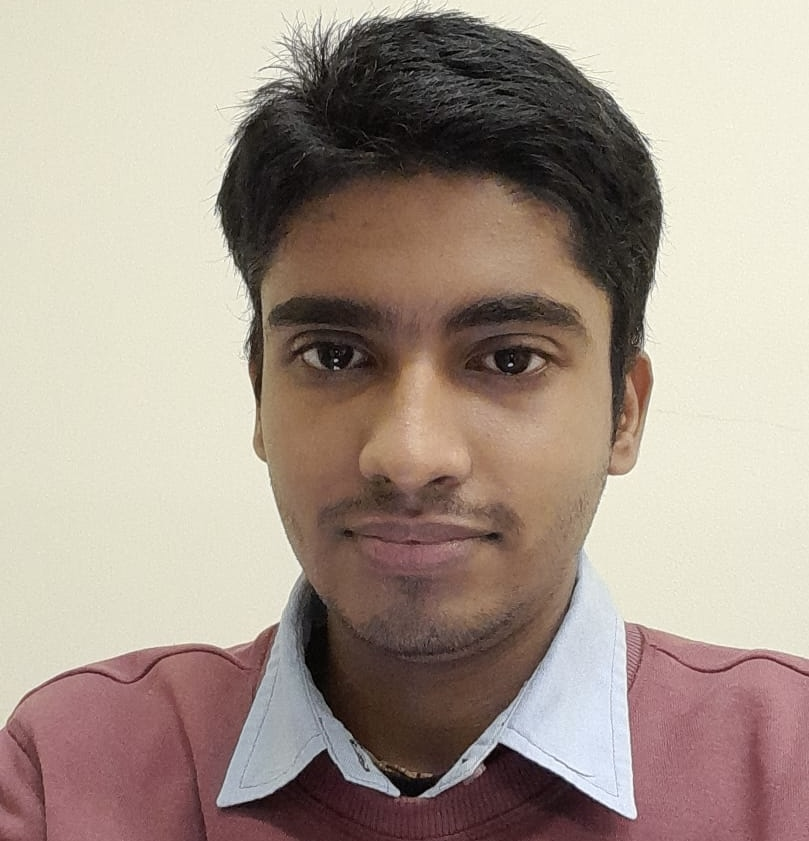

## About

I am a third‑year PhD student co‑advised by Todd Millstein and George Varghese with research interests in 
computer networks and systems, formal verification, and building LLM-based pipelines.   More specifically, 
I work on synthesizing verifiably correct implementations using new modularity techniques, and testing network 
implementations using generative AI and symbolic execution. 

## Publications

* [If Layering is useful, why not sublayering? [HotNets 2024, Presented Paper]](https://conferences.sigcomm.org/hotnets/2024/papers/hotnets24-309.pdf)
(Mentors: Todd Millstein, Scott Shenker, George Varghese)
Proposed recursively breaking up monolithic layers into simpler sublayers for ease of verification, debugging and principled hardware offload.  Proposed a new sublayering for TCP and showed sublayering could simplify verification for HDLC bit-stuffing using CoQ.

* [MESSI: Behavioral Testing of BGP Implementations [NSDI 2024, Presented paper]](https://www.usenix.org/system/files/nsdi24-singha.pdf)
(Mentors: Ryan Beckett, Siva Kakarla, Todd Millstein, George Varghese)
Automated testing of BGP Implementations such as Quagga, FRR, GoBGP, Batfish, by generating high coverage tests using symbolic execution and enumerative testing. Solved BGP-specific challenges due to statefulness, regular expressions, and incremental updates. Our tool found 22 bugs across 5 BGP implementations.

* [TransLIST : A Transformer-Based Linguistically Informed Sanskrit Tokenizer [Published at EMNLP 2022]](https://arxiv.org/pdf/2210.11753.pdf)
(Mentors: Laxmidhar Behera, Pawan Goyal, IIT Kanpur)
Developed a novel Sanskrit word segmentation model combining character-level input with latent word information and an ensemble-based constrained inference algorithm, achieving 1.8-point F-score and 7.2-point PM gains over SOTA.

## Research Projects
* [Eywa: Automating Model Based Testing using LLMs [Submitted to SIGCOMM'25]](https://drive.google.com/file/d/1Qme1n7HAnF8ndsiEBORygyUZbRgRp-iD/view?usp=sharing) 
(Mentors: Ryan Beckett, Siva Kakarla, Todd Millstein, George Varghese)
Created a LLM-based tool to automatically generate models for network protocols like DNS and BGP; surprisingly, LLM errors enrich the test suite rather than affect coverage. We found 15 new bugs in 10 DNS implementations and 4 new bugs in 3 BGP implementations.

## Internships

* Microsoft Research Internship 2024: Generating Models from Specifications using LLMs
(Mentor: Akash Lal)
Developed a tool (MockGen) using an LLM to generate models (called mock implementations) as well as high-coverage test cases from OpenAPI specifications for Azure services such as DNS and BlockBlob. Unlike AutoMessi which uses symbolic execution, I used the LLM to directly generate tests and fed back the test results to the LLM to improve the mock. This achieved a mock accuracy of 95% relative to manually written mocks.

* Microsoft Research Internship 2023: Securing Azure RBAC with Static Analysis [Applied for Patent]
(Mentors: Behnaz Arzani, Ryan Beckett, Nikolaj Bjorner, Siva Kakarla)
Developed a static analysis tool for Azure RBAC to verify policies, detect duplicates, and generate exhaustive tests for Azure Implementations. We reduced the verification time for large policies from 30 minutes to 0.16s using various optimization algorithms. We also found 5 discrepancies across C\# and C++ implementations of Azure RBAC.

